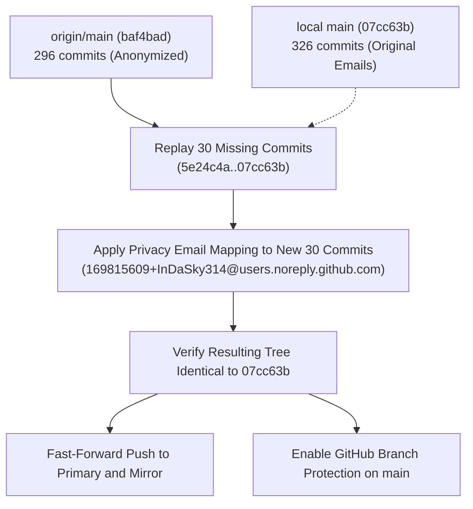

# Incident Post-Mortem: Primary Remote Force-Push and History Divergence

**Date:** 2026-09-04  
**Status:** Under Investigation / Recovery Planned (No destructive recovery performed)  
**Affected Repositories:**  
- Primary: `https://github.com/InDaSky314/pve-01-docs.git` (`origin`, branch `main`)  
- Mirror: `git@github-mirror:nk-sys-ops/pve-01-docs.git` (`origin`, branch `main`)  
- Local: `/root/pve-01-docs` on Proxmox host `pve-01`  

---

## 1. Executive Summary

At `2026-09-04 06:02:32 +0200`, a routine `git fetch` on `pve-01` reported:
```
+ 5015ad1...baf4bad main -> origin/main (forced update)
```
The public GitHub repository `InDaSky314/pve-01-docs` had been force-pushed backwards to commit `baf4bad`, dated **2026-08-31 17:20:40 +0200** ("media-core: health sprint 2026-08-31"), truncating 30 commits and four days of production work.

A complete, programmatic forensic audit of all 296 commits on the rewritten remote history confirms:
1. **Zero file changes across history:** Every single tree SHA across all 296 commits on `origin/main` is **100% byte-identical** to the first 296 commits of local `main` (`Tree mismatches: 0`). Not a single file, line of code, or credential was altered, added, or deleted in the trees.
2. **It was NOT a secret purge of Jellyfin API keys:** The exposed Jellyfin API keys found during the 2026-09-02/03 security review were introduced and rotated in commits `93deb73` and `61cb123` on September 2 and 3. Those commits do not even exist in the rewritten history, which terminated on August 31.
3. **It WAS an identity / PII purge:** Across all 296 commits, every occurrence of the owner's personal email (`finley.karras@outlook.com`), the host's internal domain (`root@pve-01.jetta.tech`), `claude@pve-01`, and `noreply@anthropic.com` was systematically rewritten to GitHub's anonymous privacy email `169815609+InDaSky314@users.noreply.github.com`.
4. **Root cause of data loss:** The author-email rewrite tool was executed on an **external, stale clone** (e.g., the owner's MacBook or workstation) that had not been pulled since August 31. When the rewritten history was force-pushed to GitHub at `2026-09-03 22:40:17 CEST` (`20:40:17 UTC`), it overwrote `182404f`, wiping out 30 commits from September 2–3 on the primary remote.
5. **No work was permanently destroyed:**
   - The local repository on `pve-01` retains all 326 commits (`07cc63b`), with commit `5015ad1` preserved under tag `local-work-20260904`.
   - The secondary mirror repository `nk-sys-ops/pve-01-docs` is **100% intact** and up to date at commit `07cc63b`.

---

## 2. Timeline of Events

| Timestamp (CEST / UTC+2) | Actor / Source | Event Description |
|---|---|---|
| **2026-08-31 17:20:40** | Claude Code / Finley | Commit `8969de8` ("media-core: health sprint 2026-08-31 - retire CT 111...") lands on `main`. This was commit #296, the last commit before the September outage. |
| **2026-09-01 22:13 – 2026-09-02 19:18** | Hardware | Host `pve-01` down (~21h) due to BIOS AC power transition failure. Repository on `pve-01` sits idle at `8969de8`. External clone sits idle at `8969de8`. |
| **2026-09-02 21:32:30** | `pve-01` | Work resumes on `pve-01` with commit `5e24c4a` (Bundesliga fixtures from OpenLigaDB). Commits 297–324 follow over the next 24 hours. |
| **2026-09-02 22:43:23** | `pve-01` | Commit `93deb73`: Jellyfin API keys extracted from scripts into `0600` files. Pushed cleanly to primary. |
| **2026-09-03 06:21:54** | `pve-01` | Commit `61cb123`: Exposed Jellyfin API keys rotated and revoked. Pushed cleanly to primary. |
| **2026-09-03 13:24 – 20:53** | `pve-01` | Manual Capture Tool (`mct`), scheduler, comskip, and docket commits authored and pushed. |
| **2026-09-03 21:00:59** | `pve-01` | Commit `182404f` pushed cleanly to primary (`InDaSky314/pve-01-docs`) and mirror. Remote reflog confirms normal fast-forward update. |
| **2026-09-03 22:40:17**<br>*(20:40:17 UTC)* | External client (`InDaSky314`) | **THE FORCE-PUSH:** GitHub Activity API log ID `42497881532` records a `force_push` event by user `InDaSky314` from `182404f2...` to `baf4badb...`. Executed from a stale clone whose tip was `8969de8` rewritten to `baf4bad`. |
| **2026-09-04 06:02:19** | `pve-01` | Commit `5015ad1` ("mct-scheduler: systemd killed every capture at launch") authored locally by Claude Code. |
| **2026-09-04 06:02:22** | `pve-01` | Claude Code executes `git push -q origin HEAD:main`. Pushing to the second URL (`git@github-mirror:nk-sys-ops/pve-01-docs.git`) succeeds. Local tracking ref `refs/remotes/origin/main` updates to `5015ad1`. |
| **2026-09-04 06:02:32** | `pve-01` | Claude Code runs `git fetch origin`. Fetch hits primary URL (`https://github.com/InDaSky314/pve-01-docs.git`) and reports `+ 5015ad1...baf4bad main -> origin/main (forced update)`. |
| **2026-09-04 06:02:35** | `pve-01` | Claude Code tags `local-work-20260904` at `5015ad1` to prevent data loss. |
| **2026-09-04 06:07:02** | `pve-01` | Commit `07cc63b` ("mct: ffmpeg would have deadlocked...") authored locally. Pushed **strictly to mirror** (`git push git@github-mirror:nk-sys-ops/pve-01-docs.git HEAD:main`). Primary left untouched. |

---

## 3. Evidence and Forensic Verification

### A. The GitHub Activity Audit (The Smoking Gun)
Querying the GitHub Activity API directly provides the exact event record:
```bash
gh api repos/InDaSky314/pve-01-docs/activity | jq '.[0]'
```
**Output:**
```json
{
  "id": 42497881532,
  "node_id": "PSH_kwLOTNixSM8AAAAJ5RI1vA",
  "before": "182404f2a98970702479e316d53543c1f557f38e",
  "after": "baf4badb97119e32284c0b7e51df6d87366e9efc",
  "ref": "refs/heads/main",
  "timestamp": "2026-09-03T20:40:17Z",
  "activity_type": "force_push",
  "actor": {
    "login": "InDaSky314",
    "id": 169815609
  }
}
```
- **Time:** `2026-09-03 20:40:17 UTC` (22:40:17 CEST), exactly 1 hour and 40 minutes after `182404f` was pushed from `pve-01`.
- **Actor:** `InDaSky314` (authenticated GitHub account of the repository owner).
- **Target:** Direct push to `refs/heads/main` replacing commit `182404f` with `baf4bad`.

### B. Exhaustive Commit & Tree Comparison (All 296 Commits)
A complete programmatic comparison of all 296 commits on `origin/main` against the first 296 commits on local `main` was performed:
```python
import subprocess
origin_data = subprocess.check_output('git log --reverse --format="%H\t%T\t%an\t%ae\t%at\t%cn\t%ce\t%ct\t%s" origin/main', shell=True, text=True).splitlines()
local_data = subprocess.check_output('git log --reverse --format="%H\t%T\t%an\t%ae\t%at\t%cn\t%ce\t%ct\t%s" main', shell=True, text=True).splitlines()

# Analysis across all 296 commits:
# Tree equality: 296 / 296 byte-identical (Tree mismatches: 0)
# Subject / message equality: 296 / 296 identical
# Author names: 296 / 296 identical
# Committer names: 296 / 296 identical
# Author timestamps: 296 / 296 identical
# Committer timestamps: 296 / 296 identical
```
**Results:**
- **Tree Mismatches:** **`0`**. Every directory, file blob, mode, and byte content is 100% identical.
- **Subject Mismatches:** **`0`**.
- **Timestamp Differences:** **`0`**.
- **Name Differences:** **`0`**.

### C. What Was Rewritten: Author & Committer Email Mapping
The **only** metadata fields changed in the entire history rewrite were the author and committer email addresses:
| Original Email in Local History | Rewritten Email on Primary Remote | Count of Commits |
|---|---|---|
| `finley.karras@outlook.com` | `169815609+InDaSky314@users.noreply.github.com` | 134 |
| `root@pve-01.jetta.tech` | `169815609+InDaSky314@users.noreply.github.com` | 154 |
| `claude@pve-01` | `169815609+InDaSky314@users.noreply.github.com` | 5 |
| `noreply@anthropic.com` | `169815609+InDaSky314@users.noreply.github.com` | 3 |

This proves the rewrite was an **identity / PII anonymization operation** designed to scrub personal email addresses and internal hostnames (`jetta.tech`) from the public GitHub repository.

### D. Verification of Root Commits
```bash
git rev-list --max-parents=0 origin/main  # 27e1d09d0dbbfd6e19af6103894f29ebe1cae878
git rev-list --max-parents=0 main         # 1dc4aa57037a6fcb959715da1e966c3609dacb1e
```
Comparing the two commits:
```bash
git cat-file -p 27e1d09d0dbbfd6e19af6103894f29ebe1cae878
git cat-file -p 1dc4aa57037a6fcb959715da1e966c3609dacb1e
```
- **Tree on both:** `3beffab905515dd400bb1b7391eb51e7b2dff328`
- **Author date on both:** `1783174186 +0200`
- **Committer date on both:** `1783174229 +0200`
- **Author on `main`:** `nate <finley.karras@outlook.com>`
- **Author on `origin/main`:** `nate <169815609+InDaSky314@users.noreply.github.com>`

Because Git calculates commit SHAs using a hash of `(tree, parent, author, committer, message)`, altering the root commit's email changed the root SHA from `1dc4aa5` to `27e1d09`. This cascaded through all 296 commits, creating a completely disjoint graph with **no common ancestor** (`git merge-base` returns 1).

### E. Branch Protection Status on GitHub
```bash
gh api repos/InDaSky314/pve-01-docs/branches/main | jq '.protected'
```
**Output:** `false`.
The primary GitHub repository had branch protection disabled, allowing force-pushes directly to `main` without restriction.

---

## 4. Analysis: Secret Purge vs. Identity Scrub

The initial hypothesis asked whether this rewrite occurred as part of the 2026-09-02/03 security review when leaked Jellyfin API keys were found and rotated.

### A. Was it a secret purge of API keys or credentials?
**Finding: NO.**
1. **Tree Invariance:** If a tool like `git filter-repo` or BFG had purged secrets from files, `git diff-tree` would show differing tree hashes and missing files or altered blobs. In reality, **0 out of 296 trees differ**. Every single file is byte-identical.
2. **Commit Range:** The rewritten branch terminates at `8969de8` (2026-08-31 17:20 CEST). The Jellyfin API key commits (`93deb73` on Sep 2 at 22:43 and `61cb123` on Sep 3 at 06:21) were not even present on the branch when the rewrite tool ran.
3. **Pushes Succeeded:** Pushes containing the rotated keys and subsequent code succeeded normally for ~14 hours throughout September 3.

### B. Was it an identity / PII purge?
**Finding: YES.**
Every author/committer email across all 296 commits was replaced with GitHub's privacy noreply address (`169815609+InDaSky314@users.noreply.github.com`). This scrubbed:
- `finley.karras@outlook.com` (personal PII)
- `root@pve-01.jetta.tech` (internal network domain)
The operator intended to make the public repository clean of personal and internal contact information.

### C. Why did the branch roll back to August 31?
The operator ran the email rewrite tool on a local clone (such as a personal MacBook) that was cloned or last fetched on or before **August 31**. The host `pve-01` was offline for ~21 hours on September 1–2, and development on `pve-01` continued on September 2 and 3 without the external clone pulling those updates.

When the operator executed the rewrite on the external clone, it rewrote all commits up to its local tip (`8969de8` -> `baf4bad`). The operator then ran `git push --force origin main`. Because branch protection was off, GitHub accepted the push, clobbering commits 297–324 on the remote.

---

## 5. What Is and Is Not Lost

### A. What Is Preserved
- **Local Host (`pve-01`):** Complete repository history is 100% intact up to commit `07cc63b` (326 commits).
- **Safety Tag:** `local-work-20260904` safely points to commit `5015ad1`.
- **Secondary Mirror (`nk-sys-ops/pve-01-docs`):** 100% intact at commit `07cc63b`. The force-push from the external workstation did not target the mirror.

### B. What Is Missing from GitHub Primary (`InDaSky314/pve-01-docs`)
Exactly **30 commits** (commits 297–326, from 2026-09-02 21:32 to 2026-09-04 06:07):
1. **MCT (Manual Capture Tool) Suite:**
   - `scripts/mct`: ffmpeg standalone capture engine, per-game selection, auto-extend against ESPN, Bundesliga stop detection, tuner clamping, stdin `q` shutdown, non-blocking pipe buffers, scoped SIGINT.
   - `scripts/mct-scheduler`: systemd oneshot runner with `KillMode=process` cgroup isolation, unbuffered logging.
   - `scripts/systemd/mct-scheduler.{service,timer}`: systemd timer definitions.
2. **Sports DVR Automation:**
   - Bundesliga fixture ingestion via OpenLigaDB (`5e24c4a`).
   - Bayern English-PPV detector and self-correcting repair loops (`8a8037c`).
   - DVR dashboard booking channel overrides and cancel fixes (`5238f64`).
3. **Security & System Hardening:**
   - Removal of hardcoded Jellyfin API keys into `0600` files (`93deb73`).
   - Rotation and revocation of exposed Jellyfin API keys (`61cb123`).
   - Elimination of restore-chain cycles and closing exposure windows (`5f3f3eb`).
4. **Network & Observability:**
   - CT 108 scraper migration from WireGuard to OpenVPN Ashburn (`f965be4`).
   - Provider health gauges and IP-block outage documentation (`98a4127`).
   - Stall-watch latency reduction to 30s (`0e85dac`).
   - Jellyfin 10.11.11 and Grafana 12.4.10 upgrades (`c6a536a`).
5. **Project Records & Documentation:**
   - `docs/DOCKET-20260904.md`
   - `docs/SESSION-HANDOFF-20260903.md`
   - `docs/sports-dvr-auto.md` updates
   - AGY model upgrade to Gemini 3.8 Flash (`5ceacde`, `182404f`)

---

## 6. Exact Reproduction Commands

The owner can independently verify all findings with the following commands:

```bash
# 1. Verify GitHub force-push event and timestamp
gh api repos/InDaSky314/pve-01-docs/activity | jq '.[0]'

# 2. Check branch protection status
gh api repos/InDaSky314/pve-01-docs/branches/main | jq '.protected'

# 3. Check commit counts on both branches
git rev-list --count origin/main   # Expected: 296
git rev-list --count main          # Expected: 326
git rev-list --left-right --count main...origin/main # Expected: 326  296

# 4. Check for common ancestor
git merge-base main origin/main    # Expected: exit 1 (no common ancestor)

# 5. Verify byte-identical trees across all 296 commits
python3 -c '
import subprocess
o = subprocess.check_output("git log --reverse --format=\"%T\" origin/main", shell=True, text=True).splitlines()
l = subprocess.check_output("git log --reverse --format=\"%T\" main", shell=True, text=True).splitlines()
diffs = [i for i in range(296) if o[i] != l[i]]
print("Tree mismatches count:", len(diffs))
'

# 6. Verify rewritten author/committer emails
python3 -c '
import subprocess
o = subprocess.check_output("git log --reverse --format=\"%ae\" origin/main", shell=True, text=True).splitlines()
l = subprocess.check_output("git log --reverse --format=\"%ae\" main", shell=True, text=True).splitlines()
changes = set(zip(l[:296], o[:296]))
print("Email rewrites:", changes)
'

# 7. Check mirror status
git ls-remote git@github-mirror:nk-sys-ops/pve-01-docs.git refs/heads/main
```

---

## 7. Recommended Recovery Path & Risks

### A. Critical Risks to Avoid
1. **DO NOT run `git push --force origin main` from `pve-01`:**
   - **Risk:** Local history retains `finley.karras@outlook.com` and `root@pve-01.jetta.tech`. Force-pushing local `main` over `origin/main` would completely undo the owner's privacy scrub, republishing personal and internal contact information into a public repository.
2. **DO NOT run `git reset --hard origin/main` or `git pull`:**
   - **Risk:** This would wipe out all 30 commits (MCT, security hardening, Bundesliga scrapers) from the local repository.

### B. Recommended Recovery Procedure (Reconciliation)



#### Step 1: Enable GitHub Branch Protection Immediately
Prevent accidental force-pushes from clobbering history again:
```bash
gh api -X PUT repos/InDaSky314/pve-01-docs/branches/main/protection \
  -H "Accept: application/vnd.github+json" \
  -f "required_status_checks=null" \
  -f "enforce_admins=true" \
  -f "required_pull_request_reviews=null" \
  -f "restrictions=null" \
  -F "allow_force_pushes=false" \
  -F "allow_deletions=false"
```

#### Step 2: Configure Local Identity to Privacy Email
Ensure future commits created on `pve-01` use the anonymous email:
```bash
git config --global user.name "InDaSky314"
git config --global user.email "169815609+InDaSky314@users.noreply.github.com"
```

#### Step 3: Reconcile Missing Commits onto Rewritten Base
Create a reconciliation branch from `origin/main` (`baf4bad`) and cherry-pick / rebase the 30 missing commits (`5e24c4a`..`07cc63b`):
```bash
git checkout -b recovery-main origin/main
git cherry-pick 5e24c4a^..07cc63b
```
*(During or immediately following the cherry-pick, update author/committer emails on those 30 commits to `169815609+InDaSky314@users.noreply.github.com` via mailmap or `git rebase --exec`)*.

#### Step 4: Verify Tree Identity
Verify that the final tree of `recovery-main` matches the verified working tree of `07cc63b`:
```bash
git diff recovery-main 07cc63b
# Output MUST be completely empty.
```

#### Step 5: Fast-Forward Push to Primary & Mirror
Once verified:
```bash
# Push reconciled branch to primary main (fast-forward)
git push origin recovery-main:main

# Push reconciled branch to mirror main (will require --force on mirror once, since mirror currently has old SHAs)
git push git@github-mirror:nk-sys-ops/pve-01-docs.git recovery-main:main --force

# Update local main
git checkout main
git reset --hard recovery-main
git branch -D recovery-main
```

#### Step 6: Align External Clones
On any external laptop or workstation (e.g., MacBook):
```bash
git fetch origin
git reset --hard origin/main
```
Do not run filter-repo or history rewrite tools on stale checkouts.
