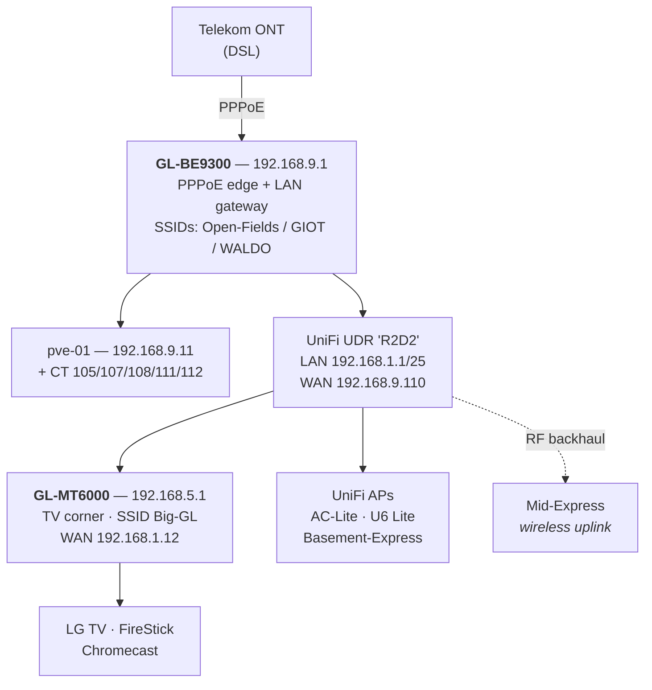

# Network Topology & Router Inventory

**Rewritten 2026-08-28**, the morning after the cutover. The previous version
(2026-08-09) described a *proposed* re-layout — making the BE9300 the DSL
head-end and moving the Proxmox host behind it. That proposal is now reality, so
this file describes what exists rather than what was being considered.

Everything below was verified directly against each device, not assumed.

---

## Current topology



Text form, for terminals:

```
Telekom ONT ──PPPoE──▶ BE9300 (192.168.9.1)   ◀── the edge, do not power-cycle
                          ├──▶ pve-01 (192.168.9.11) + containers
                          └──▶ UDR / R2D2 (WAN 192.168.9.110, LAN 192.168.1.1/25)
                                   ├──▶ MT6000 (WAN 192.168.1.12, LAN 192.168.5.1) ──▶ TV corner
                                   ├──▶ AC-Lite · U6 Lite · Basement-Express (wired)
                                   └┄┄▶ Mid-Express (WIRELESS backhaul — see warning)

GL-MT2500 — RETIRED. Unplugged from the ONT during the cutover.
```

---

## Inventory

| Device | IP | Model | Role | SSH |
|---|---|---|---|---|
| **BE9300** | `192.168.9.1` | GL-BE9300 "Flint 3" (WiFi 7) | **PPPoE edge + LAN gateway** | `glinet-9.1` |
| **MT6000** | `192.168.5.1` | GL-MT6000 "Flint 2" | TV corner router | `glinet-5.1` (LAN, unreachable from pve-01) / `glinet-5.1-ts` (Tailscale) |
| **R2D2** | `192.168.1.1` | UniFi Dream Router | UniFi controller + APs | `unifi-1.1` **(broken — see below)** |
| MT2500 | — | GL-MT2500 "Brume 2" | **RETIRED** | `glinet-2.1` (dead alias) |
| pve-01 | `192.168.9.11` | Proxmox host | media-core stack | — |

**The BE9300 changed address.** It was `192.168.3.1`; the `192.168.3.0/24`
subnet no longer exists. The MT6000 previously held `192.168.9.1` and moved to
`192.168.5.1`. If you see `glinet-3.1` or `192.168.2.x` anywhere, it is stale.

---

## Access gotchas

**pve-01 can no longer reach the UDR at `192.168.1.1`.** Before the cutover
pve-01 sat *behind* the UDR; it is now a sibling on the far side of the UDR's
WAN. The UDR is healthy — reach it over Tailscale at `100.114.159.40`.
`/root/uni.sh` probes the LAN address first and falls back automatically.

**The MT6000's LAN is likewise unreachable from pve-01.** Use `glinet-5.1-ts`.
Note this does *not* stop the MT6000 shipping syslog to the collector — the
router pushes outbound, so the missing return route is irrelevant.

**SSH host keys legitimately changed.** `192.168.9.1` now answers with the
BE9300's key, not the MT6000's. Verify a changed key against the same host's
Tailscale entry before clearing it — never accept blindly.

---

## Addressing

| Subnet | Owner | Purpose |
|---|---|---|
| `192.168.1.0/25` | UDR | Default UniFi network |
| `192.168.4.0/24` | UDR | VPN (VLAN 4) |
| `192.168.5.0/24` | MT6000 | **TV corner** (LG TV, FireStick, Chromecast) |
| `192.168.9.0/24` | BE9300 | **Main LAN** — pve-01 and all containers |
| `192.168.10.0/24` | BE9300 | IoT — the WALDO SSID, bound to the German tunnel |
| `192.168.15/16.0/24` | MT6000 | guest/iot, **disabled** — re-addressed so they can never collide |
| `192.168.20.0/24` | UDR | IoT (VLAN 20) |
| `192.168.30.0/24` | BE9300 | Guest — the GIOT SSID, bound to the US tunnel |
| `192.168.40.0/24` | UDR | Lambeau (VLAN 40) |

`192.168.2.0/24` and `192.168.3.0/24` are **gone**. `192.168.6.0/24` is
advertised to the tailnet by the MT2500 but has no interface behind it — a stale
advertisement worth clearing in the Tailscale admin console.

---

## Egress design

| Source | Exits via | Verified location |
|---|---|---|
| CT 105 media-core, CT 111 jellyfin-vod, CT 112 jellyfin-npvr | `wgclient1` | **Zürich** — required for IPTV |
| CT 107 log-server, CT 108 scraper | `wgclient3` | **Ashburn** |
| pve-01 host | none | **native Telekom** (owner's choice) |
| WALDO SSID (`br-iot`) | `wgclient2` | Frankfurt |
| GIOT SSID (`br-guest`) | `ovpnclient1` | New York |
| Open-Fields (`br-lan`) | none | native |

Always verify by **exit IP**, never by config: every Surfshark peer is handed the
same client address `10.14.0.2/24`, so the config cannot tell you which exit you
actually got.

---

## Wireless

BE9300 runs 2.4 / 5 / 6 GHz plus MLO: `mld0` → `br-lan` (Open-Fields),
`mld1` → `br-guest` (GIOT). WALDO is 2.4 + 5 only.

**`wifi reload` does not apply radio enable/disable on this box** — measured. Use
`wifi down <radio>` / `wifi up <radio>`, which works in both directions with no
reboot. See `radio-shutoff-plan.md`.

**Mid-Express uplinks over RF to the UDR.** Disabling the UDR's radios strands it
and its clients. It re-associates automatically when they return, so a
time-boxed schedule is safe; a permanent disable is not, until it is cabled.

---

## The PPPoE line

Untagged on `eth0` — **no VLAN 7**, which German Telekom lines often need.
Credentials are staged at `/root/cutover/.pppoe-creds` on the BE9300 (mode 600).

Telekom forces a **re-auth roughly nightly**, changing the public IP (observed
`93.209.195.65` → `84.149.191.129` → `84.149.178.215`). All four tunnels
re-establish through it unattended — verified twice. Alerting deliberately uses
a 5-minute window so the routine reconnect does not page.

---

## Related

- `cutover-20260827/00-RUNBOOK.md` — how the cutover was performed, with rollback
- `cutover-20260827/overnight-report-20260828.md` — what broke and how it was fixed
- `cutover-20260827/radio-shutoff-plan.md` — radio power-off and timer plan
- `glinet-api-cli-runbook.md` — **read first** for any GL router work
- `lessons-learned.md` — traps already paid for
